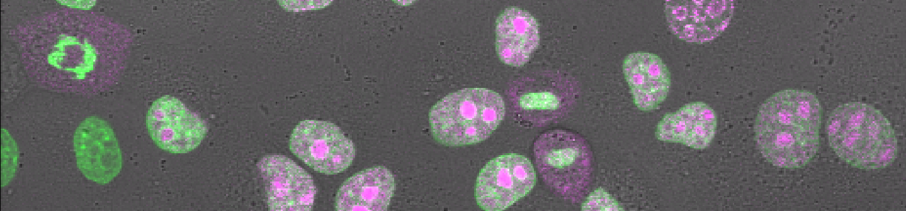
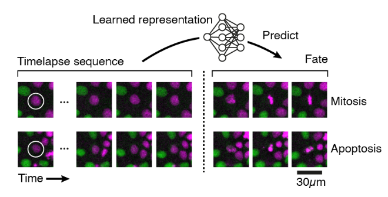

[](https://github.com/psf/black)
[](lowe-lab-ucl/cellx-predict/actions)



# cellx-predict

This package provides a reference implementation of a tau-VAE. The tau-VAE network is able to learn an explainable model of cell behaviour from timelapse-image sequences.

<p align="center">
  
</p>

## Installation and requirements

### Dependencies

The software requires Python 3.7 (or greater), `numpy`, `scipy`, `tqdm`, `Tensorflow`, `scikit-image` and `scikit-learn`. Further, this repo makes extensive use of the [`cellx`](https://github.com/quantumjot/cellx) and [`btrack`](https://github.com/quantumjot/BayesianTracker) libraries. Full requirements can be found in the `requirements.txt` file.

### Running in a Docker container

We recommend running this in a docker container.

Build the image:

```sh
git clone https://github.com/lowe-lab-ucl/cellx-predict.git
cd cellx-predict
docker build . -t cellxpred/cellxpred:latest
```

You can use the included shell script to run the container and specify the jobs according to the descriptions below.

```sh
./run_docker.sh
```

### Local installation

You can also clone and install a local version of the software.

```sh
git clone https://github.com/lowe-lab-ucl/cellx-predict.git
cd cellx-predict
pip install -e .
```

### Hardware requirements

#### Training

We have tested the software on the following systems, a Ubuntu 20.04LTS server with 256 Gb RAM and NVIDIA V100 GPU and an Ubuntu 18.04LTS server with 128 Gb RAM and NVIDIA GTX1080Ti GPUs.

#### Inference

We tested the software on OS X and Ubuntu and found the inference algorithm to be performant even on basic commodity hardware such as laptops.

## Data structure

We recommend structuring your data in the following format. Within the glimpses folder, the name of subfolders (e.g. apoptosis, mitosis) are used to infer the ground truth labels of the data contained within each folder.

```
training/
  patches/
    README.md
    image_patches_0.tfrecord
  glimpses/
    README.md
    data/
      apoptosis/
        GV0800_Pos3_7_RFP_apop.tif
      mitosis/
    metadata/
      apoptosis/
        GV0800_Pos3_7_RFP_apop.npz
      mitosis/
inference/
  glimpses/
    GV0804_Pos12_18_RFP_mit.tif
```

### Data availability

Datasets to enable training and inference are available from the UCL data repository using the following DOI: https://dx.doi.org/10.5522/04/16578959

## Usage

The model needs to be trained in three separate operations:

1. First the `encoder` model is trained
2. Then the `projector` model is trained
3. Finally, the `temporal` model is trained.

For inference, we use the `full` model.

Command line options for each part of the pipeline can be listed using the help argument:

```sh
python run_training.py -h
```

Once trained, model weights and other parameters are stored in the models folder.

### 1. Encoder model

#### 1.1 Training the encoder model

```sh
python run_training.py \
  --model=encoder \
  --src_dir=/path/to/training/patches \
  --log_dir=/path/to/log_dir \
  --input_shape='(64, 64, 2)'
  --epochs=50 \
```

#### 1.2 Monitoring training using Tensorboard

During training of any model, the optimization can be monitored using Tensorboard:

```sh
tensorboard --logdir /path/to/log_dir
```

#### 1.3 Training the projector model

```sh
python run_training.py \
  --model=projector \
  --src_dir=/path/to/training/patches \
```

### 2. Temporal model

#### 2.1 Prepare training data for the temporal model

Before training the temporal model, you will need to prepare the training data using parameters of the encoder model. To do so, run the following script:

```sh
python run_prepare.py \
  --model=temporal \
  --src_dir=/path/to/training/glimpses \
  --use_rotations
```

#### 2.2 Training the temporal model

The temporal model is trained using the following script:

```sh
python run_training.py \
  --model=temporal \
  --src_dir=/path/to/training/glimpses \
  --log_dir=/path/to/log_dir \
  --epochs=50 \
  --use_synthetic \
  --use_probabilistic_encoder \
```

The training can be monitored using Tensorboard as above.

### 3. Inference

An example notebook using the full model to perform inference (`inference.ipynb`) can be found in the notebooks folder.

# Citation

```bibtex
@article{Soelistyo2021.11.24.469554,
  author = {Soelistyo, Christopher and Vallardi, Giulia and Charras, Guillaume and Lowe, Alan R},
  title = {Learning the rules of cell competition without prior scientific knowledge},
  elocation-id = {2021.11.24.469554},
  year = {2021},
  doi = {10.1101/2021.11.24.469554},
  publisher = {Cold Spring Harbor Laboratory},
  URL = {https://www.biorxiv.org/content/early/2021/11/25/2021.11.24.469554},
  eprint = {https://www.biorxiv.org/content/early/2021/11/25/2021.11.24.469554.full.pdf},
  journal = {bioRxiv}
}
```
